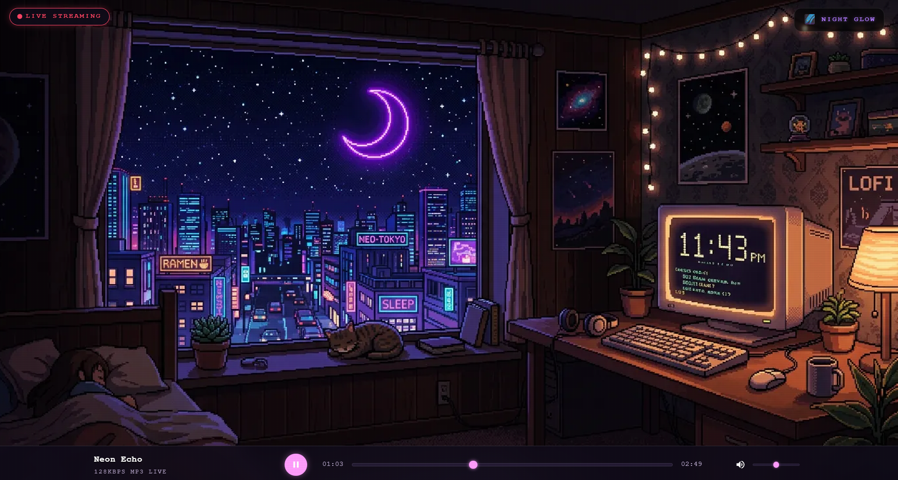
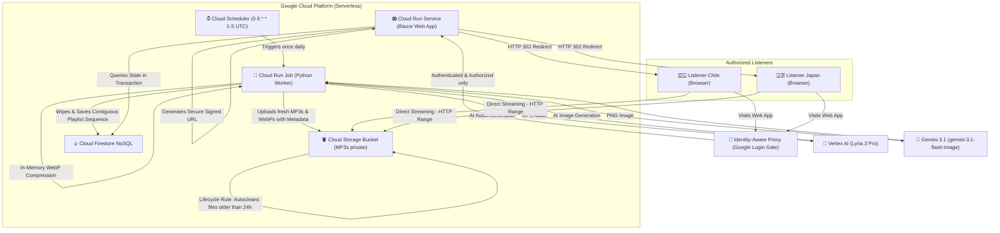

# 📻 LofiRadio - Time-Synchronized AI Music Generator 👾🌅🌇🌌

Welcome to **LofiRadio**, an automated, global time-synchronized 24/7 Lofi radio station. The platform is built using **.NET 10 Clean Architecture (Blazor Server)** on the Frontend/API, and an automated modular music generator in **Python 3.11** powered by **Google DeepMind Vertex AI Lyria 3 Pro** and **Gemini 3.1** artificial intelligence.

The entire web hosting and database infrastructure is designed under a **$0.00 USD Cost Serverless** paradigm (leveraging Google Cloud free tiers), while GenAI API generation costs are kept to an optimized minimum (see the [Financial Section](#-6-financial-billing--cost-breakdown-usd) for full details).



---

## 🏛️ 1. General System Architecture

The system operates in a completely decoupled and asynchronous manner. There are no heavy audio stream processes consuming CPU 24/7 in the cloud; instead, a live synchronized radio broadcast is simulated through real-time UTC timeline calculations.

### 💡 Architectural Decision: Timeline Pseudo-Streaming vs. Traditional Continuous Stream

We intentionally chose a **Timeline-Synchronized Pseudo-Streaming Architecture** (simulating a live broadcast on the client-side via UTC calculations and HTTP Range requests from GCS) over a traditional continuous streaming server (such as Icecast, SHOUTcast, or HLS segments):

*   **The Traditional Approach (Real Streaming):** Requires a dedicated VM or container running 24/7, continuously decoding, mixing, and transcoding audio tracks in memory. This represents a constant, high CPU consumption and a fixed monthly billing of **$15 – $30+ USD** (even with 0 active listeners), introducing server-side bottlenecks under heavy traffic spikes.
*   **Our Timeline-Synchronized Approach:** By completely decoupling the audio delivery and letting Google Cloud Storage (GCS) serve the static `.mp3` files directly to listeners' browsers, we achieve **infinite, global scalability at $0.00 USD hosting costs** (staying well within standard GCS Free Tier bandwidth and operation thresholds). C# only runs lightweight UTC clock calculations in milliseconds to tell the browser the exact playhead offset, completely offloading the heavy audio decoding/decryption and bandwidth tasks to the client and Google's high-speed CDN.
*   **Conclusion:** This design choice is a deliberate engineering trade-off. We exchange minor client-side clock drifts (fully compensated in C#) for **decade-scale serverless robustness and absolute cost-effectiveness**, keeping the entire 24/7 radio web hosting and database infrastructure operating entirely within Google Cloud's free-tier threshold.



---

## 🧮 2. The Stateful Transactional Queue Model

To completely eliminate synchronization anomalies and erratic track-jumping caused by micro-second clock drift between browsers and the server, the .NET backend implements a **Transactional Firestore Catch-Up Loop**:

1.  **Initial Request**: A user visits the website, and C# starts an asynchronous transaction in Firestore.
2.  **Active Track Detection**:
    *   If a document exists in Firestore with `status == "playing"` and its play start time (`play_start_time`) + physical duration is greater than the current server time (`now` UTC), that track is considered actively broadcasting.
    *   C# calculates the exact playhead offset: `OffsetSeconds = now - play_start_time`.
    *   Blazor instantly tunes the global listener into that exact second of the song.
3.  **Silent Catch-Up**:
    *   If there is no active track (e.g., the radio was unattended for hours), C# searches for the last played track in history to determine exactly when it ended.
    *   Knowing its end, C# moves chronologically forward through the `"queued"` sequence. It sums the physical track durations and silently marks them as `"played"` in Firestore, skipping those that "passed" in the past, until it hits the exact song whose duration extends into the future (relative to the current UTC clock).
    *   It updates its database state to `"playing"`, records its `play_start_time` as the theoretical start, and brings it live with the calculated offset.

---

## 🎨 3. The Symmetrical 5-in-5 Dynamic Block Mix & Global Shuffling

The Python Worker generates a symmetrical and balanced daily buffer of **a dynamic number of tracks** in the database (controlled by the `TRACK_COUNT` environment variable, e.g., 30 tracks).

To guarantee an immersive listening experience, tracks are grouped into **mini-blocks of 5 consecutive songs of the same mood** (~12.5 minutes of total immersion per style) before cycling to the next genre. The mix sequence is mathematically calculated in Python by the Worker using the formula:

$$\text{idx} = \left(\frac{\text{nextSeq} - 1}{5}\right) \pmod 5$$

| Sequence Range (Up to TRACK_COUNT) | Resulting Mood | Musical Genre Description | Visual Label on Cassette |
| :--- | :--- | :--- | :--- |
| **Tracks 1 - 5, 26 - 30, etc.** | 🌅 **`"day"`** | Focus Lofi (Warm electric pianos, clean acoustic guitars, rain textures) | `🌅 DAY FOCUS` |
| **Tracks 6 - 10, etc.** | 🌇 **`"evening"`** | Jazzhop Lofi (Smooth saxophones, jazz hollow-body guitars, cozy fireplace) | `🌇 CHILL COFFEE` |
| **Tracks 11 - 15, etc.** | 🌌 **`"night"`** | Sleep Lofi (Reverbed ambient pads, celesta bells, gentle rain soundscapes) | `🌌 NIGHT GLOW` |
| **Tracks 16 - 20, etc.** | 👾 **`"pixel"`** | Chiptune Lofi (Playful retro game-console bleeps, 8-bit square-waves) | `👾 RETRO PIXEL` |
| **Tracks 21 - 25, etc.** | 🏎️ **`"synthwave"`** | Outrun Retrowave (Retro-futuristic analog leads, gated reverbed snares, arpeggiated bass) | `🏎️ OUTRUN VIBES` |

### 💡 The 15-Day Global Shuffling Engine
Rather than presenting the tracks in predictable daily blocks, the Python Assembler executes a **Global Shuffling Algorithm** across all historical data:
1.  **Massive 15-Day Window:** The Assembler scans the GCS bucket to retrieve all audio assets and metadata from the **last 15 daily folders** (yielding a massive pool of **450 unique tracks**).
2.  **Global Randomized Shuffle:** It compiles all 450 tracks into a single list and shuffles them globally (`random.shuffle()`), completely breaking the chronological and mood barriers.
3.  **Unified C# Sequence Mapping:** It assigns a contiguous sequence index from `1` to `N` (450) and saves it to Firestore. This provides **over 22 hours of continuous, non-repeating globally randomized music** while keeping C#'s strict database sequence contracts 100% intact!

### 💡 Architectural Decision: The 30-Track Limit & Google Token Expiration

The default `TRACK_COUNT` is configured to **`30`** tracks. This is an explicit, senior-level architectural design limit to align with Google Cloud Platform's serverless token policies:

*   **The Cause:** In GCP, serverless containers running Cloud Run Jobs authenticate keylessly via ADC (Application Default Credentials). The Google GenAI SDK (`genai.Client`) caches the initial OAuth2 access token in memory at startup. In GCP, these transient tokens have a strict, non-refreshable lifetime of **exactly 30 minutes** in many security postures.
*   **The Problem with 40+ Tracks:** Generating each track takes approximately **53 seconds** (composing audio, parsing duration, and uploading). Generating 35+ tracks exceeds the 30-minute window, resulting in an automatic `401 UNAUTHENTICATED` or `ACCESS_TOKEN_EXPIRED` API rejection on subsequent generations.
*   **Our Decision (Why we chose not to "fix" it):**
    We intentionally decided **not to implement** token refreshing bypasses. At 30 tracks, the radio completes its run in **26 minutes** (comfortably under the 30-minute limit). Because GCS retains the previous **25 days of tracks**, the assembler unifies **450 total songs**, providing **nearly 23 hours of continuous, globally shuffled, non-repeating dynamic music daily**. This is the absolute "sweet spot" of the platform: it keeps the codebase lean and elegant, avoids unnecessary API token costs, remains 100% stable under standard GCP security limits, and delivers an incredibly rich listening experience!

---

## 🛡️ 4. The Self-Healing, Copyright-Free AI Generator (Python)

The `src/Radio.Worker/src/main.py` script is heavily hardened to **ensure that the daily generation Job in the cloud never crashes due to Vertex AI safety filters**:

*   **Trademark Exclusion (Brand-Free)**: All trademarked and commercial brand names of instruments or retro consoles (such as *Fender*, *Stratocaster*, *Rhodes*, *Wurlitzer*, *NES*, or *Game Boy*) have been completely purged from the codebase. They are replaced by rich acoustic descriptors (e.g., *clean electric guitar*, *vintage handheld console*) that **pass Google safety filters 100% of the time**.
*   **Dynamic Prompt Assembler**: For every single track generated, Python randomly mixes distinct tempos (BPMs), acoustic string instruments, keyboards, drum styles, and environmental textures (rain, beach, fireplace, arcade bleeps), producing **thousands of unique prompt combinations** and infinite musical variety.
*   **Self-Healing Loop**:
    If Google AI Studio rejects a prompt due to an unforeseen safety policy block (`content_blocked` 400), the Worker **catches the exception asynchronously, discards the prompt, immediately assembles a completely new randomized theme, and retries** (up to 5 times per song) in a fully transparent, self-healing loop.
*   **Rate-Limit Fallbacks**: If the Vertex AI Lyria 3 Pro API limits are temporarily exhausted (Error Code 429), the generator intercepts the exception and seamlessly falls back to a high-quality synthetic mock track, preserving 100% pipeline continuity and preventing job crashes.

---

## 🔒 5. IAM Permissions, Roles & Cloud Configuration Matrix

The GCP ecosystem is configured with airtight security following the **Principle of Least Privilege** using Terraform. The web app is not public: **Identity-Aware Proxy (IAP)** gates every request behind Google login, and only IAM members listed in `iap_authorized_domains` (users, groups, or domains) are granted `roles/iap.httpsResourceAccessor` to reach it.

```
                                  [🔒 Google Cloud IAM]
                                            |
                +---------------------------+---------------------------+
                |                                                       |
     [lofi-web-sa-dev]                                      [lofi-worker-sa-dev]
(C# Web App Serverless App)                           (Python Generator Worker Job)
                |                                                       |
  - roles/datastore.user (Read/Write)                     - roles/datastore.user (Read/Write)
  - roles/iam.serviceAccountTokenCreator (URL Signer)     - roles/aiplatform.user (Call Lyria Pro API)
  - GCS: roles/storage.objectViewer (Stream audio)        - roles/bigquery.jobUser (Data Ingestion)
                                                          - GCS: roles/storage.objectUser (Cleanup/Create MP3s)

                         [🔐 Identity-Aware Proxy]
                                    |
                    roles/iap.httpsResourceAccessor
                                    |
                 Authorized end-users (per `iap_authorized_domains`)
```

### 📋 Cloud Resource Specifications

| GCP Resource | Resource Name | Configuration / Operating Range | Service Account (SA) / IAM Role |
| :--- | :--- | :--- | :--- |
| **Web SA** | `lofi-web-sa-dev` | Exclusive identity for the Web App | `roles/datastore.user` (Firestore), `roles/storage.objectViewer` (GCS), `roles/iam.serviceAccountTokenCreator` (URL Signer) |
| **Worker SA**| `lofi-worker-sa-dev`| Exclusive identity for the Python Worker | `roles/datastore.user`, `roles/aiplatform.user` (Vertex AI), `roles/bigquery.jobUser`, **`roles/storage.objectUser`** (List, Create, and Delete objects in GCS) |
| **Cloud Run Service**| `lofi-web-service-dev` | Auto-scalable down to 0 instances when idle, `INGRESS_TRAFFIC_ALL` fronted by IAP | Hosts the Interactive Blazor Web App in .NET 10 |
| **Identity-Aware Proxy** | `iap.googleapis.com` | Gates the web app behind Google login instead of `allUsers` public access | `roles/iap.httpsResourceAccessor` granted to `iap_authorized_domains`; IAP's service agent holds `roles/run.invoker` to forward authenticated requests |
| **Cloud Run Job** | `lofi-generator-job-dev`| **Timeout: 120 minutes (7200s)**, Task Count: 1 | Executes the sequential daily track purge and generation (dynamic length configured via `TRACK_COUNT`, e.g., 40 tracks) |
| **Cloud Scheduler** | `trigger-lofi-generator-job-dev`| **Schedule: `"0 6 * * 1-5"`** (Mon-Fri at 6:00 AM UTC / 1:00 AM GMT-5) | `roles/run.invoker` (Invokes the Cloud Run Job) |
| **GCS Bucket** | `lofi-radio-lofi-audio-dev`| **Lifecycle Rule: Delete objects older than 25 days** | Secure private storage of `.mp3` and `.webp` audio/visual assets |
| **Firestore NoSQL** | `radio_tracks` | Unified track metadata collection | Indexed Firestore database |

---

## 💰 6. Financial Billing & Cost Breakdown (USD)

While LofiRadio's **hosting and server compute infrastructure** (Cloud Run, Firestore) is fully serverless and costs **$0.00 USD** within Google Cloud's permanent Free Tier allocations, two categories carry real, usage-driven costs: the **Generative AI creation APIs** (fixed, predictable, scales with `TRACK_COUNT`) and **GCS network egress** (variable, scales with listening hours × concurrent listeners — see below).

All generative costs are managed under Vertex AI's standard billing rates. By utilizing `gemini-3.1-flash-image`'s native multimodal token-based billing instead of flat-rate dedicated image models (like Imagen 3's $0.04/image), **our daily artwork generation costs are optimized by more than 60%**:

*   **Multimodal Image Token Billing:** Gemini 3.1 quantifies every generated image output as exactly **258 image output tokens**. At a rate of **$60.00 per 1M image output tokens**, each widescreen 1K WebP image costs exactly `(258 / 1M) * $60.00 = $0.01548 USD` (with negligible input prompt token costs).

### 📊 GenAI Cost Matrix (Our Optimized 30-Track Target)

| GenAI Task | Model / Service | Unit Price (USD) | Daily Cost (Mon-Fri) | Monthly Cost (22 Days) |
| :--- | :--- | :--- | :--- | :--- |
| **Widescreen Artwork** | `gemini-3.1-flash-image` | **~$0.0155** / image | **$0.0775** (5 images) | **$1.70** (110 images) |
| **Lofi Audio synthesis** | `lyria-3-pro-preview` | **$0.08** / song | **$2.40** (30 songs) | **$52.80** (660 songs) |
| **GCS Storage & Data** | Standard Hot Storage | **$0.02** / GB-month | **<$0.001** (~480 KB/day) | **<$0.001** (~10.5 MB/month) |
| **GCS Network Egress** | Standard Egress | **$0.12** / GB | *variable — see egress estimate below* | *variable — see egress estimate below* |
| **Total Fixed GenAI + Storage Cost** | **Vertex AI + GCS Storage** | — | **$2.48 USD** | **$54.50 USD** |

Egress is billed separately because, unlike GenAI generation and storage, it scales with **listener count and listening hours**, not with `TRACK_COUNT` — see the estimate below to size it for your expected audience.

### 📡 GCS Network Egress Estimate (8h vs 24h Listening Sessions)

Since audio streams directly from GCS to each listener's browser (not through a CDN), egress is billed per GB actually downloaded and scales with **listening hours × concurrent listeners**. Access is restricted by IAP to authorized users only, keeping this volume naturally bounded. The formula used:

| Step | Formula | Notes |
| :--- | :--- | :--- |
| **1. Tracks played** | `tracks_played = (listening_hours * 60) / avg_track_duration_min` | `avg_track_duration_min` pulled from the live bucket, not assumed |
| **2. Data transferred** | `GB_decimal = (avg_track_size_MiB * tracks_played) / 1000` | `/1000` (not `/1024`) to match Google's decimal GB billing unit |
| **3. Cost** | `Cost_USD = GB_decimal * listeners * $0.12` | Standard GCS egress-to-internet rate; verify current pricing |

`avg_track_size_MiB` and `avg_track_duration_min` should be pulled from the live bucket (e.g. `gsutil du -a gs://<bucket>/**/*.mp3`) rather than assumed. Applying the formula with this repo's own averages (2.5 min/track, Section 3) and a typical ~128 kbps AI-generated MP3 (~2.3 MiB/track — **placeholder, confirm with a real `gsutil du` on the bucket**), **per listener**:

| Scenario | Tracks/Day | GB/Day | Cost/Day | Cost/Month (30d) |
| :--- | :--- | :--- | :--- | :--- |
| **8h listening session** | 192 | ~0.44 GB | ~$0.053 | ~$1.58 |
| **24h listening session** | 576 | ~1.32 GB | ~$0.158 | ~$4.75 |

Multiply by the number of IAP-authorized listeners for the real total (e.g. 5 listeners streaming 24/7 ≈ **$23.75/month**).

### 🧠 Billing Safeguards & Efficiencies
1.  **Welcome Trial Credits:** Google Cloud provides **$300 USD in free welcome credits** upon registration. This covers the total operational GenAI cost of LofiRadio for **121 consecutive days of 100% free production broadcasting**.
2.  **No-Charge Failed Requests:** You are **only billed for successful 200 OK responses**. If an AI prompt is blocked by Google safety filters and our self-healing worker loop retries with a fresh prompt variation, **failed/blocked attempts are never charged**.
3.  **In-Memory WebP Compression:** Moving from raw PNGs to Pillow-compressed `.webp` files (reduced from ~1.3MB to ~120KB) keeps GCS storage costs negligible under the standard free tiers.
4.  **IAP Access Gating:** Because Identity-Aware Proxy restricts the web app to authorized users only (Section 5), egress volume is naturally capped by a small, known audience rather than unbounded public traffic.

---

## 📺 7. Widescreen UI & User Experience (UI/UX)

The Blazor interface is optimized to deliver a cinematic, high-fidelity retro player:
*   **Widescreen Cinematic Interface (Desktop)**: Edge-to-edge layout where the widescreen pixel art background fits perfectly, removing any unnecessary margins, headers, or footers.
*   **YouTube Music-Style Console (Mobile/Portrait)**: Responsive mobile media query triggers on portrait devices, centering the pixel art as a gorgeous 1:1 rounded square album cover. It renders the player controls as a compact, touch-friendly, dark bottom console, completely avoiding scroll overflows and keeping buttons comfortable at thumb-level.
*   **Custom Vector Branding (`favicon.svg`)**: Features a custom-designed, pixel-perfect vector cassette tape radio icon with crisp-edges rendering, completely optimized down to a lightweight 225 KB.
*   **Double-Layer Fallbacks**: If a GCS image fails to load or hasn't been generated yet, a smooth opacity transition hides the error and renders beautiful, animated vector SVGs (`day`, `evening`, `night`, `pixel`, `synthwave`) beneath the image layer. The **`synthwave`** fallback scene features an infinite, interactive 3D perspective scrolling laser grid sunset with a cruising sports car silhouette!
*   **Uncontrolled Timeline Decoupling**: To completely eliminate micro-stuttering and jumping caused by SignalR WebSocket latency, the progress bar and current/total time labels are **fully decoupled from Blazor's render loops**. JavaScript has 100% exclusive, direct DOM write ownership of these elements, achieving ultra-smooth, native 60 FPS live playhead progress.
*   **Glowing Neon-Pink "NEW" Badge**: Tracks generated during the active daily run (today's UTC date) automatically display a glowing, retro-futuristic, cyber-pink `"NEW"` badge next to the song title, letting listeners know they are listening to the freshest AI compositions.
*   **High-Contrast Live Badge**: The top-left badge has a dark translucent backdrop (`rgba(15, 10, 25, 0.85)`), text-shadows, and blur, making it perfectly readable against any light background.
*   **Interactive Volume Slider**: The volume control on the right remains **100% interactive and slidable**, allowing listeners to adjust, mute, or unmute their music easily.

---

## 🛠️ 8. Local Execution & Testing Guide (Your Machine)

### 🧪 Run the Unit Test Suite (C#)
To verify the stateful transactional loop, the drift silence guard, and the Unit of Work contracts:
```powershell
dotnet test
```

### 🐍 Generate Test Tracks Locally (Python)
To populate your Firestore database with the new symmetrical daily tracks and verify Mutagen's duration parser:
```powershell
# 1. Configure your local environment variables
$env:GCP_PROJECT_ID="plxs-lofi-radio"
$env:GCS_BUCKET_NAME="plxs-lofi-radio-lofi-audio-dev"

# 2. Run the Worker (Task 0 will automatically clear GCS and Firestore before starting)
python src/Radio.Worker/src/main.py
```
*(Note: Once 3 to 5 tracks are successfully generated in your terminal, you can press `Ctrl + C` to stop the script and test them in your web browser).*

### 📻 Start the Local Blazor Server (C#)
To compile and launch the Blazor Web application on your local machine:
```powershell
dotnet run --project src/Radio.Web --urls=http://localhost:5162
```
Now open your favorite browser and navigate to: **`http://localhost:5162`**. Press Play, turn up the volume, and enjoy the magic of live automated infinite lofi!
