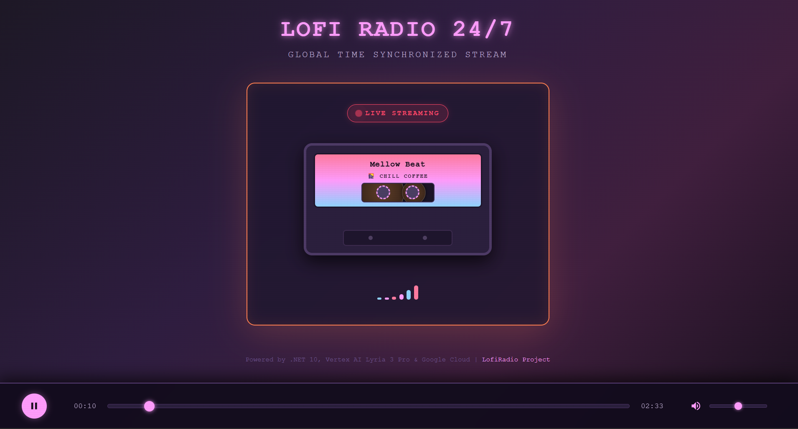
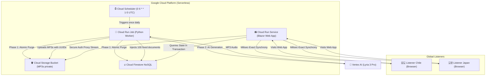

# 📻 LofiRadio 24/7 - Exact Time-Synchronized Streaming & AI Music Generator 👾🌅🌇🌌

Welcome to **LofiRadio**, an automated, global time-synchronized 24/7 Lofi radio station. The platform is built using **.NET 10 Clean Architecture (Blazor Web)** on the Frontend/API, and an automated music generator in **Python 3.11** powered by **Google DeepMind Vertex AI Lyria 3 Pro** artificial intelligence.

The entire ecosystem is designed under a **$0.00 USD Cost Serverless** paradigm utilizing Google Cloud Platform (GCP) infrastructure.

<p align="center">
  
</p>

---

## 🏛️ 1. General System Architecture

The system operates in a completely decoupled and asynchronous manner. There are no heavy audio stream processes consuming CPU 24/7 in the cloud; instead, a live synchronized radio broadcast is simulated through real-time UTC timeline calculations.



---

## 🧮 2. The Stateful Transactional Queue Model

To completely eliminate synchronization anomalies and erratic track-jumping caused by micro-second clock drift between browsers and the server, the .NET backend implements a **Transactional Firestore Catch-Up Loop**:

1.  **Initial Request**: A user visits the website, and C# starts an asynchronous transaction in Firestore.
2.  **Active Track Detection**:
    *   If a document exists in Firestore with `status == "playing"` and its play start time (`play_start_time`) + physical duration is greater than the current server time (`now` UTC), that track is considered actively broadcasting.
    *   C# calculates the exact playhead offset: `OffsetSeconds = now - play_start_time`.
    *   Blazor instantly tunes the global listener into that exact second of the song.
3.  **Silent Catch-Up**:
    *   If there is no active track (e.g., the radio was unattended for hours), C# searches for the last played track in history to determine exactly when it ended.
    *   Knowing its end, C# moves chronologically forward through the `"queued"` sequence. It sums the physical track durations and silently marks them as `"played"` in Firestore, skipping those that "passed" in the past, until it hits the exact song whose duration extends into the future (relative to the current UTC clock).
    *   It updates its database state to `"playing"`, records its `play_start_time` as the theoretical start, and brings it live with the calculated offset.

---

## 🎨 3. The Symmetrical 5-in-5 Dynamic Block Mix (Option B)

The Python Worker generates a symmetrical and balanced daily buffer of **exactly 100 tracks** in the database (with fixed sequence indexes from **`1` to `100`**).

To guarantee a diverse listening experience, tracks are grouped into **mini-blocks of 5 consecutive songs of the same mood** (~12.5 minutes of total immersion per style) before cycling to the next genre. The mix sequence is mathematically calculated in Python by the Worker using the formula:

$$\text{idx} = \left(\frac{\text{nextSeq} - 1}{5}\right) \pmod 4$$

| Sequence Range (Fixed 1 to 100) | Resulting Mood | Musical Genre Description | Visual Label on Cassette |
| :--- | :--- | :--- | :--- |
| **Tracks 1 - 5, 21 - 25, 41 - 45...** | 🌅 **`"day"`** | Focus Lofi (Warm electric pianos, clean guitars, vinyl crackle) | `🌅 DAY FOCUS` |
| **Tracks 6 - 10, 26 - 30, 46 - 50...** | 🌇 **`"evening"`** | Jazzhop Lofi (Smooth saxophones, jazz hollow-body guitars, cozy fireplace) | `🌇 CHILL COFFEE` |
| **Tracks 11 - 15, 31 - 35, 51 - 55...** | 🌌 **`"night"`** | Sleep Lofi (Reverbed pianos, ambient pads, gentle rain soundscapes) | `🌌 NIGHT GLOW` |
| **Tracks 16 - 20, 36 - 40, 56 - 60...** | 👾 **`"pixel"`** | Chiptune Lofi (Playful retro NES/Gameboy bleeps, 8-bit square-waves) | `👾 RETRO PIXEL` |

---

## 🛡️ 4. The Self-Healing, Copyright-Free AI Generator (Python)

The `src/Radio.Worker/main.py` script is heavily hardened to **ensure that the daily generation Job in the cloud never crashes due to Vertex AI safety filters**:

*   **Trademark Exclusion (Brand-Free)**: All trademarked and commercial brand names of instruments or retro consoles (such as *Fender*, *Stratocaster*, *Rhodes*, *Wurlitzer*, *NES*, or *Game Boy*) have been completely purged from the codebase. They are replaced by rich acoustic descriptors (e.g., *clean electric guitar*, *vintage handheld console*) that **pass Google safety filters 100% of the time**.
*   **Dynamic Prompt Assembler**: For every single track generated, Python randomly mixes distinct tempos (BPMs), acoustic string instruments, keyboards, drum styles, and environmental textures (rain, beach, fireplace, arcade bleeps), producing **thousands of unique prompt combinations** and infinite musical variety.
*   **Self-Healing Loop**:
    If Google AI Studio rejects a prompt due to an unforeseen safety policy block (`content_blocked` 400), the Worker **catches the exception asynchronously, discards the prompt, immediately assembles a completely new randomized theme, and retries** (up to 5 times per song) in a fully transparent, self-healing loop.

---

## 🔒 5. IAM Permissions, Roles & Cloud Configuration Matrix

The GCP ecosystem is configured with airtight security following the **Principle of Least Privilege** using Terraform.

```
                                  [🔒 Google Cloud IAM]
                                            |
                +---------------------------+---------------------------+
                |                                                       |
     [lofi-web-sa-dev]                                      [lofi-worker-sa-dev]
(C# Web App Serverless App)                           (Python Generator Worker Job)
                |                                                       |
  - roles/datastore.user (Read/Write)                     - roles/datastore.user (Read/Write)
  - GCS: roles/storage.objectViewer (Stream audio)        - roles/aiplatform.user (Call Lyria Pro API)
                                                          - roles/bigquery.jobUser (Data Ingestion)
                                                          - GCS: roles/storage.objectUser (Cleanup/Create MP3s)
```

### 📋 Cloud Resource Specifications

| GCP Resource | Resource Name | Configuration / Operating Range | Service Account (SA) / IAM Role |
| :--- | :--- | :--- | :--- |
| **Web SA** | `lofi-web-sa-dev` | Exclusive identity for the Web App | `roles/datastore.user` (Firestore), `roles/storage.objectViewer` (GCS) |
| **Worker SA**| `lofi-worker-sa-dev`| Exclusive identity for the Python Worker | `roles/datastore.user`, `roles/aiplatform.user` (Vertex AI), `roles/bigquery.jobUser`, **`roles/storage.objectUser`** (List, Create, and Delete objects in GCS) |
| **Cloud Run Service**| `lofi-web-service-dev` | Auto-scalable down to 0 instances when idle | Hosts the Interactive Blazor Web App in .NET 10 |
| **Cloud Run Job** | `lofi-generator-job-dev`| **Timeout: 120 minutes (7200s)**, Task Count: 1 | Executes the sequential daily 100-track purge and generation |
| **Cloud Scheduler** | `trigger-lofi-generator-job-dev`| **Schedule: `"0 6 * * 1-5"`** (Mon-Fri at 6:00 AM UTC / 1:00 AM GMT-5) | `roles/run.invoker` (Invokes the Cloud Run Job) |
| **GCS Bucket** | `lofi-radio-lofi-audio-dev`| **Lifecycle Rule: Delete objects older than 24 hours** | Secure private storage of `.mp3` audio files |
| **Firestore NoSQL** | `radio_tracks` | Unified track metadata collection | Indexed Firestore database |

---

### 💵 Vertex AI Lyria 3 Billing & Cost Projection

When transitioning from the Free Tier to the commercial Paid Tier, the billing is calculated strictly on a per-request (per-song) basis, ensuring robust data privacy where user inputs are never utilized for model training.

#### Google Lyria 3 Model Pricing Table
| Model Name | Free Tier | Paid Tier (per song in USD) | Data Used for Product Improvement |
| :--- | :--- | :--- | :--- |
| **Lyria 3 Clip Preview (30s)** | Not available | **$0.04** | No |
| **Lyria 3 Pro Preview (Full Song)** | Not available | **$0.08** | No |

#### 📊 100-Track Daily Loop Financial Forecast (Paid Tier)
By running the Python generator once a day to clear GCS/Firestore and generate exactly 100 fresh, full-length tracks using `lyria-3-pro-preview`, the monthly operating cost is completely predictable and controlled:
*   **Daily Generation Cost**: $100 \times \$0.08$ = **$8.00 USD / day**
*   **Monthly Operating Cost**: $\$8.00 \times 30 \text{ days}$ = **$240.00 USD / month**
*   *Note*: Cloud compute, Firestore read/write, and Cloud Storage disk space remain completely within GCP's monthly **Free Tier ($0.00 USD)**, meaning Vertex AI is your only active operating expense.

---

## 📺 6. Widescreen UI & User Experience (UI/UX)

The Blazor interface is optimized to deliver a cinematic, high-fidelity retro retro player:
*   **Interactive Neon Cassette**: The cassette rotates physically and lights up with fluorescent indicators that dynamically adapt their color to match the playing mood.
*   **Read-Only Timeline Slider**: The widescreen timeline progress bar is styled with **`pointer-events: none;`** and the `readonly` attribute. Users can enjoy the exact second-by-second progress of the tape, but mouse/touch interactions are completely blocked to prevent manual seek actions, protecting the global synchronized live stream concept.
*   **Interactive Volume Slider**: The volume control on the right remains **100% interactive and slidable**, allowing listeners to adjust, mute, or unmute their music easily.

---

## 🛠️ 7. Local Execution & Testing Guide (Your Machine)

### 🧪 Run the Unit Test Suite (C#)
To verify the stateful transactional loop, the drift silence guard, and the Unit of Work contracts:
```powershell
dotnet test
```

### 🐍 Generate Test Tracks Locally (Python)
To populate your Firestore database with the new symmetrical daily tracks and verify Mutagen's duration parser:
```powershell
# 1. Configure your local environment variables
$env:GCP_PROJECT_ID="lofi-radio"
$env:GCS_BUCKET_NAME="lofi-radio-lofi-audio-dev"

# 2. Run the Worker (Task 0 will automatically clear GCS and Firestore before starting)
python src/Radio.Worker/main.py
```
*(Note: Once 3 to 5 tracks are successfully generated in your terminal, you can press `Ctrl + C` to stop the script and test them in your web browser).*

### 📻 Start the Local Blazor Server (C#)
To compile and launch the Blazor Web application on your local machine:
```powershell
dotnet run --project src/Radio.Web --urls=http://localhost:5162
```
Now open your favorite browser and navigate to: **`http://localhost:5162`**. Press Play, turn up the volume, and enjoy the magic of live automated infinite lofi!

---
*LofiRadio is a free, open-source software project for personal enjoyment and distributed real-time systems learning. Keep Coding & Chill!* 🎧👾🌅🌇🌌🚀
